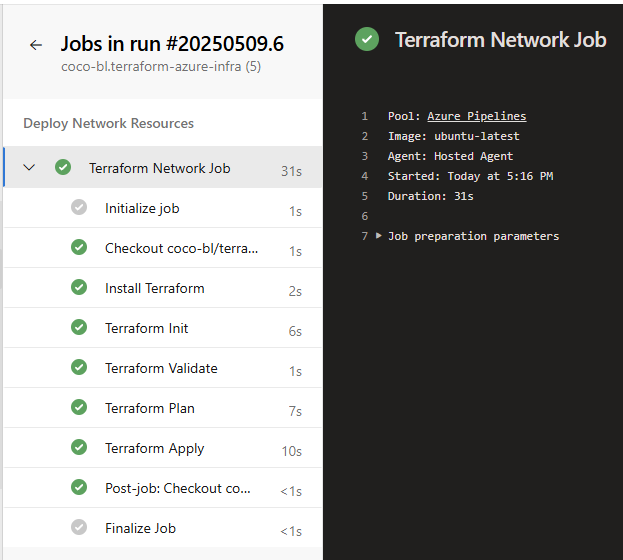
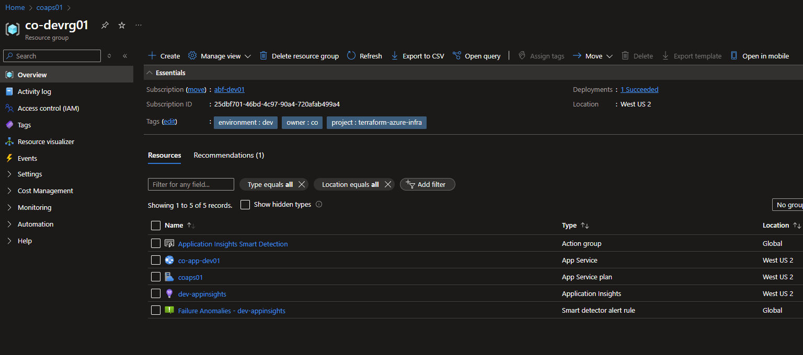
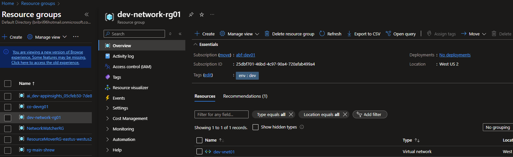
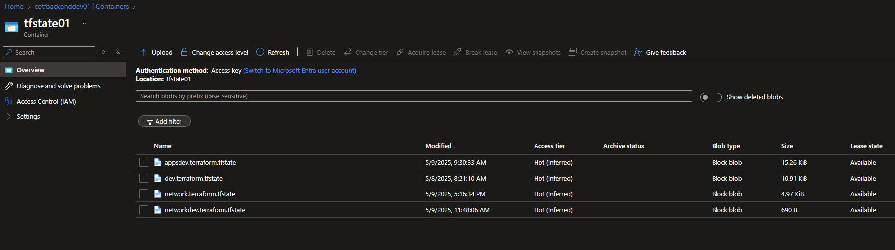

# 🚀 Terraform Azure App Service Infrastructure

| Module          | Status |
|------------------|--------|
| Network          |  |
| App Service      | |
| Resource Group   |  |
| Storage Account  | |

This project deploys a secure and scalable Infrastructure using **Terraform** and **Azure DevOps CI/CD**. It includes:

- A delegated Virtual Network (VNet) with subnet
- An App Service with subnet integration
- A Storage Account for Terraform remote state
- A Resource Group with consistent tagging
- Modular, reusable Terraform codebase
- Automated validation and deployment using Azure Pipelines

---

## 📸 Screenshots

| CI/CD Pipeline | App Service |
|----------------|-------------|
|  |  |

| Network Resources | Backend Storage |
|-------------------|-----------------|
|  |  |

---

## 🧱 Architecture Overview

